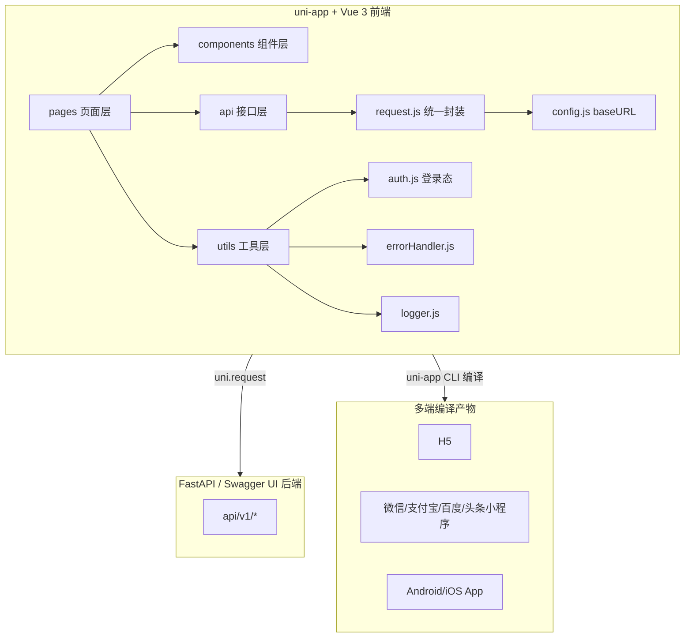
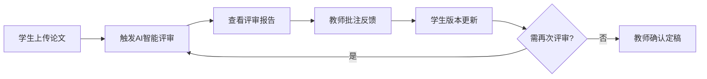
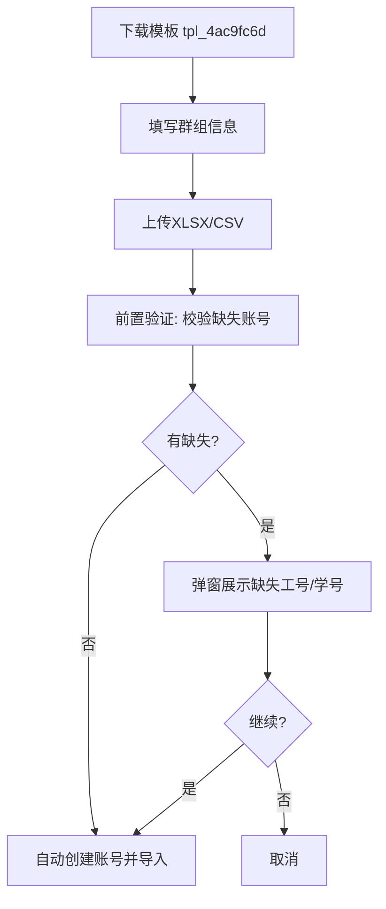

# 📚 毕设智能管理系统（6666）— 项目全景介绍

> The Academic Curator · 基于 uni-app + Vue 3 的高校毕业论文全生命周期协作与 AI 智能评审平台

---

## 目录

- [一、项目概述](#一项目概述)
- [二、技术架构角度（详细）](#二技术架构角度详细)
- [三、目录结构角度](#三目录结构角度)
- [四、功能模块角度](#四功能模块角度)
- [五、接口层设计角度](#五接口层设计角度)
- [六、核心业务流程角度](#六核心业务流程角度)
- [七、UI/UX 设计角度](#七uiux-设计角度)
- [八、工程质量角度](#八工程质量角度)
- [九、项目特色与亮点](#九项目特色与亮点)
- [十、一句话总结](#十一句话总结)

---

## 一、项目概述

**毕设智能管理系统（The Academic Curator）** 是一套面向高校毕业论文全生命周期的协作与智能评审平台，支持 **学生、教师、管理员** 三种角色，覆盖 **论文上传、版本管理、AI 智能评审、批注反馈、截止日期管理、群组管理、通知公告** 等核心业务。

| 项目信息 | 值 |
|----------|----|
| 应用 ID | `__UNI__CE8B9B3` |
| 版本号 | `1.0.0` / versionCode: 100 |
| 后端地址 | `http://8.136.35.215:8006` |
| Slogan | 毕设智能管理系统 · The Academic Curator |
| 入口页面 | `pages/index/index`（统一登录） |

---

## 二、技术架构角度（详细）

### 2.1 跨端框架：uni-app + Vue 3

本项目基于 **uni-app 官方编译器 v3**，采用 **Vue 3** 作为视图层，实现"一份代码，多端运行"。

#### ✅ 编译目标
通过 `manifest.json` 配置，可同时编译到以下 7 个平台：

| 平台 | 配置入口 | 说明 |
|------|---------|------|
| **H5** | 默认 | 使用 `index.html` 作为模板 |
| **Android App** | `app-plus.distribute.android` | 含完整权限（相机、存储、网络等 15 项） |
| **iOS App** | `app-plus.distribute.ios` | 预留配置 |
| **微信小程序** | `mp-weixin` | `urlCheck: false` 放开后端域名校验 |
| **支付宝小程序** | `mp-alipay` | `usingComponents: true` |
| **百度小程序** | `mp-baidu` | `usingComponents: true` |
| **头条小程序** | `mp-toutiao` | `usingComponents: true` |

#### ✅ Vue 版本适配
在 [main.js](file:///c:/Users/a2075/Desktop/6666%EF%BC%883%EF%BC%89/main.js) 中通过条件编译同时兼容 Vue 2/3：

```js
// #ifndef VUE3    → Vue 2 使用 new Vue().$mount()
// #ifdef VUE3     → Vue 3 使用 createSSRApp
```

`manifest.json` 显式声明 `"vueVersion": "3"`，实际运行在 Vue 3 分支。

#### ✅ 样式系统
- 使用 **rpx** 作为响应式像素单位，保证多端一致
- 设定 `"transformPx": false`，禁用 px 自动转换
- nvue 样式编译器：`"nvueStyleCompiler": "uni-app"`（兼容 Weex 原生渲染）

### 2.2 视图层与响应式

| 项 | 选型 | 理由 |
|----|------|------|
| API 风格 | **Options API** | 页面组件使用 `data/methods/computed/watch`，可读性强，团队协作友好 |
| 组件注册 | **全局自动引入** | `app-plus/mp-*` 均配置 `usingComponents: true` |
| 状态管理 | **本地存储 + 模块工具** | 未引入 Pinia/Vuex，通过 [utils/auth.js](file:///c:/Users/a2075/Desktop/6666%EF%BC%883%EF%BC%89/utils/auth.js) 的 `uni.setStorageSync` 管理 token、userInfo、userRole |
| Promise 适配 | `uni.promisify.adaptor.js` | 将 uni API 统一 Promise 化 |

### 2.3 构建与打包

- **编译器**：uni-app 官方编译器 v3（基于 Vite）
- **产物目录**：`unpackage/dist/`
- **启动画面**：`splashscreen.alwaysShowBeforeRender: true`，防止白屏

### 2.4 依赖管理（双包管理器策略）

项目同时保留 `package-lock.json` 和 `yarn.lock`：

```json
// package.json
{
  "dependencies": {
    "docx-preview": "^0.3.7"
  }
}
```

核心依赖（隐式通过 CDN 或本地引入）：

| 依赖 | 用途 | 引入方式 |
|------|------|---------|
| **docx-preview** `^0.3.7` | Word 文档在线预览 | npm 包 |
| **pdfjs-dist** | PDF 在线预览 | 本地/CDN |
| **jszip** | 论文批量 ZIP 打包 | 本地/CDN |
| **mammoth.js** `1.6.0` | Word → HTML 降级预览 | `<script src="https://cdn.jsdelivr.net/npm/mammoth@1.6.0/mammoth.browser.min.js">` |
| **canvas / pako** | pdfjs 依赖 | 间接 |

### 2.5 字体与图标

在 [index.html](file:///c:/Users/a2075/Desktop/6666%EF%BC%883%EF%BC%89/index.html) 中：

```html
<!-- 文字字体：Inter / Manrope / Noto Sans SC -->
<link href="https://fonts.googleapis.com/css2?family=Inter:..." rel="stylesheet">

<!-- Material Symbols 图标字体（本地化，避免 CDN 不稳定） -->
<link href="/static/fonts/material-symbols-local.css" rel="stylesheet">
```

**图标本地化策略**：三端（H5 / 小程序 / App）统一通过 `material-symbols-local.css` 加载本地字体文件，**不依赖 Google CDN**，保证离线环境和网络受限场景下图标正常渲染。

### 2.6 权限与安全（Android）

`manifest.json` 中申请的 15 项权限：

```
CHANGE_NETWORK_STATE / MOUNT_UNMOUNT_FILESYSTEMS / VIBRATE / READ_LOGS
ACCESS_WIFI_STATE / camera.autofocus / ACCESS_NETWORK_STATE / CAMERA
GET_ACCOUNTS / READ_PHONE_STATE / CHANGE_WIFI_STATE / WAKE_LOCK
FLASHLIGHT / hardware.camera / WRITE_SETTINGS
```

### 2.7 网络请求封装架构

三层架构：**业务页面 → 分角色 API 模块 → 统一 request 封装**

```
┌─────────────────────────────────────────┐
│  pages/*.vue（业务页面）                 │
└─────────────────┬───────────────────────┘
                  │ import
┌─────────────────▼───────────────────────┐
│  api/{user,student,teacher,admin}.js    │ ← 一接口一函数
└─────────────────┬───────────────────────┘
                  │ import { get, post, put, del, uploadFile }
┌─────────────────▼───────────────────────┐
│  api/request.js（统一封装）              │
│  · 自动 token   · 401/403 降级          │
│  · 防抖         · 错误重试（3次）        │
│  · Toast 节流   · Query 数组展开        │
└─────────────────┬───────────────────────┘
                  │
┌─────────────────▼───────────────────────┐
│  api/config.js（baseURL + timeout）     │
└─────────────────┬───────────────────────┘
                  │
             uni.request（原生）
```

### 2.8 认证与登录态

[utils/auth.js](file:///c:/Users/a2075/Desktop/6666%EF%BC%883%EF%BC%89/utils/auth.js) 提供完整的登录态管理 API：

| 函数 | 作用 |
|------|------|
| `getUserInfo()` | 读取本地 userInfo |
| `getUserId()` | 获取 `owner_id` 或 `username`，强制转数字 |
| `getUserRole()` | 返回 `student/teacher/admin` |
| `getToken()` | 读取本地 token |
| `isLoggedIn()` | 检查 token + userId 是否都存在 |
| `saveLoginState({ token, userInfo, role })` | 归一化后存入本地 |
| `clearLoginState()` | 清除 token / userInfo / userRole / refreshToken |
| `checkLogin({ redirect, message })` | 未登录则 Toast + `uni.reLaunch` 跳登录页 |
| `getAuthInfo()` | 一次性返回完整认证快照 |

**存储键**：`token` / `userInfo` / `userRole` / `refreshToken`

**userInfo 归一化字段**：
```js
{ id, userId, sub, username, name, full_name, role, college, avatar }
```

### 2.9 工具层架构

| 模块 | 职责 | 大小 |
|------|------|------|
| [utils/auth.js](file:///c:/Users/a2075/Desktop/6666%EF%BC%883%EF%BC%89/utils/auth.js) | 登录态 / token 管理 | 4.9KB |
| [utils/errorHandler.js](file:///c:/Users/a2075/Desktop/6666%EF%BC%883%EF%BC%89/utils/errorHandler.js) | 全局错误兜底 | 7.0KB |
| [utils/logger.js](file:///c:/Users/a2075/Desktop/6666%EF%BC%883%EF%BC%89/utils/logger.js) | 分级日志封装 | 2.7KB |
| [utils/performance.js](file:///c:/Users/a2075/Desktop/6666%EF%BC%883%EF%BC%89/utils/performance.js) | 性能监控上报 | 6.3KB |
| [utils/studentPaperDisplayStatus.js](file:///c:/Users/a2075/Desktop/6666%EF%BC%883%EF%BC%89/utils/studentPaperDisplayStatus.js) | 学生论文状态枚举映射 | 2.3KB |
| [utils/userAccount.js](file:///c:/Users/a2075/Desktop/6666%EF%BC%883%EF%BC%89/utils/userAccount.js) | 账户通用工具 | 5.9KB |
| [utils/functionUtils.js](file:///c:/Users/a2075/Desktop/6666%EF%BC%883%EF%BC%89/utils/functionUtils.js) | 通用函数库 | 3.6KB |

### 2.10 路由与页面导航

[pages.json](file:///c:/Users/a2075/Desktop/6666%EF%BC%883%EF%BC%89/pages.json) 中共定义 **12 个页面**：

- 登录页：`index/index`（首页启动页）
- 公共：`forgot-password/index`
- 学生端：`student/workbench`、`paperPreview`、`noticeDetail`、`ziye`、`attachmentList`
- 教师端：`teacher/dashboard`、`profile`、`MessageCenter`
- 管理端：`admin/management`、`profile`

**导航栏策略**：
- 工作台 / 仪表盘 / 登录页 / 管理端 → `navigationStyle: custom`（自绘头部，完全自定义）
- 列表 / 详情 / 个人中心 → 原生导航栏，背景 `#1890ff`，文字 `white`

**全局样式**：
```json
{
  "navigationBarTextStyle": "black",
  "navigationBarBackgroundColor": "#F8F8F8",
  "backgroundColor": "#F8F8F8"
}
```

### 2.11 App 入口与生命周期

[App.vue](file:///c:/Users/a2075/Desktop/6666%EF%BC%883%EF%BC%89/App.vue) 仅保留三个全局钩子：`onLaunch` / `onShow` / `onHide`，无全局样式污染，所有样式均由各页面独立管理。

### 2.12 编辑器与调试

- `.vscode/settings.json`：VSCode 工作区配置
- `process.env.NODE_ENV === 'development'` 分支下开启：
  - 详细请求日志
  - 401/403/404 开发期降级（返回空数据而非强制退登）
  - 422 错误详细打印

### 2.13 技术架构总览图



---

## 三、目录结构角度

```
6666（3）/
├── api/                          # 接口层（统一封装）
│   ├── config.js                 # 后端地址 + 超时时间
│   ├── request.js                # uni.request 封装（307行）
│   ├── user.js                   # 登录/注册/找回密码（2.1KB）
│   ├── student.js                # 学生端接口（26.2KB，最复杂）
│   ├── teacher.js                # 教师端接口（18.2KB）
│   ├── admin.js                  # 管理员端接口（20.0KB）
│   └── README.md                 # 接口使用说明
├── pages/                        # 页面层（按角色划分）
│   ├── index/                    # 统一登录页
│   ├── forgot-password/          # 找回密码
│   ├── student/                  # 学生端（5个页面）
│   ├── teacher/                  # 教师端（6个页面 + api.js + mockData.js）
│   └── admin/                    # 管理员端（2个页面）
├── components/                   # 复用组件
│   ├── PaperDetailModal.vue      # 论文详情弹窗（18KB）
│   ├── WordPreview.vue           # Word 在线预览（40KB，最大）
│   ├── VersionCompareModal.vue   # 版本对比
│   ├── UploadModal.vue           # 上传弹窗
│   ├── ConfirmModal.vue          # 通用确认弹窗
│   └── TeacherSelectModal.vue    # 选择指导老师
├── utils/                        # 工具层（7个模块）
├── static/                       # 静态资源（logo、封面图、本地字体）
├── unpackage/dist/               # 编译产物
├── pages.json                    # 页面路由与导航配置
├── manifest.json                 # 多端编译配置
├── App.vue / main.js             # 入口
├── uni.scss                      # 全局 SCSS 变量
├── package.json / yarn.lock      # 双包管理器
└── index.html                    # H5 模板（字体引入）
```

---

## 四、功能模块角度

### 🧑‍🎓 学生端（5 页）
| 页面 | 功能 |
|------|------|
| workbench.vue | 学生工作台，查看待办、DDL、指导老师反馈 |
| ziye.vue | "我的论文"列表，含上传/版本更新/下载 |
| paperPreview.vue | 论文 Word/PDF 在线预览 |
| attachmentList.vue | 附件列表管理 |
| noticeDetail.vue | 公告详情 |

**核心能力**：论文上传 → AI 智能评审触发 → 查看评审报告 → 教师批注反馈 → 版本迭代 → 最终定稿

### 👨‍🏫 教师端（6 页）
| 页面 | 功能 |
|------|------|
| dashboard.vue | 教师仪表盘（班级总览、论文数量、待审阅） |
| PaperPreview.vue | 论文审阅，添加批注/反馈 |
| PaperDownload.vue | 按群组批量下载论文 |
| DeadlineSetting.vue | **按群组编号**设置截止日期（支持"全部班级"汇总只读视图） |
| MessageCenter.vue | 消息中心 |
| profile.vue | 个人中心 |

### 👨‍💼 管理员端（单文件超大页面）
[pages/admin/management.vue](file:///c:/Users/a2075/Desktop/6666%EF%BC%883%EF%BC%89/pages/admin/management.vue) 单文件 **11000+ 行**，内含：

1. **群组管理**：创建/编辑/删除，支持手动指定 `group_id`
2. **批量导入师生关系**：上传 CSV/XLSX，含**前置验证**→缺失账号弹窗→二次确认
3. **论文按群组 ZIP 打包下载**
4. **用户与权限**、**公告中心**、**控制台**、**查看群组关系**
5. **模板下载**：
   - 师生关系导入模板：`tpl_4ac9fc6d`
   - 用户导入模板：`tpl_20a279a0`

### 🔐 认证模块
- 统一登录页：角色切换 + 验证码
- 忘记密码：短信/邮箱验证码重置

---

## 五、接口层设计角度

### 5.1 统一请求封装（[api/request.js](file:///c:/Users/a2075/Desktop/6666%EF%BC%883%EF%BC%89/api/request.js)）

对外暴露 5 个方法：`get / post / put / del / uploadFile`，提供以下能力：

| 能力 | 实现 |
|------|------|
| **自动鉴权** | 默认附加 `Authorization: Bearer <token>` |
| **请求防抖** | `pendingRequests` Map 防止 300ms 内重复请求 |
| **Toast 防抖** | 相同错误 2 秒内只弹一次（`TOAST_INTERVAL = 2000`） |
| **错误重试** | 5xx / 网络错误最多重试 3 次，指数退避（`RETRY_DELAY = 1000`） |
| **401/403 降级** | 开发期返回空数据触发降级，正式期强制退登 |
| **Query 数组参数** | 自动展开 `teacher_ids=t1&teacher_ids=t2` |
| **二进制响应** | 支持 `responseType: 'arraybuffer'` 下载文件 |

### 5.2 接口约定

- **统一返回格式**：`{ code: 200, data: any, message?: string }`
- 所有路径仅写 `/api/xxx`，不带 baseURL
- `needAuth` 参数：登录、验证码、忘记密码等公开接口传 `false`

### 5.3 分角色接口文件

| 文件 | 大小 | 职责 |
|------|------|------|
| [api/user.js](file:///c:/Users/a2075/Desktop/6666%EF%BC%883%EF%BC%89/api/user.js) | 2.1KB | 登录/注册/验证码 |
| [api/student.js](file:///c:/Users/a2075/Desktop/6666%EF%BC%883%EF%BC%89/api/student.js) | 26.2KB | 论文/AI评审/附件 |
| [api/teacher.js](file:///c:/Users/a2075/Desktop/6666%EF%BC%883%EF%BC%89/api/teacher.js) | 18.2KB | 班级/审阅/批注 |
| [api/admin.js](file:///c:/Users/a2075/Desktop/6666%EF%BC%883%EF%BC%89/api/admin.js) | 20.0KB | 群组/用户/导入 |

---

## 六、核心业务流程角度

### 流程 1：学生论文全生命周期



### 流程 2：管理员批量导入师生关系



### 流程 3：教师按群组管理截止日期

- **筛选群组编号** → 展示该群组 DDL 详情（可编辑）
- **留空 / 全部** → 汇总只读视图，展示所有班级的 DDL 总览

---

## 七、UI/UX 设计角度

1. **设计语言**：现代卡片式设计，圆角 `24rpx`，阴影 `0 20rpx 60rpx rgba(0,0,0,0.15)`
2. **主色**：`#1890ff`（蓝色）
3. **弹窗规范**：
   - 遮罩：`rgba(0,0,0,0.6)` + `backdrop-filter: blur(8rpx)`
   - 动画：`fadeIn 0.3s` + `slideUp` 内容进入
   - 错误提示**内嵌化**展示（在表单下方而非 toast）
4. **图标字体**：**Material Symbols 本地化**，三端统一通过 `material-symbols-local.css` 加载，不依赖 CDN
5. **导航栏**：多数页面使用 `navigationStyle: custom` 自绘头部
6. **字体栈**：Inter / Manrope / Noto Sans SC（H5 从 Google Fonts 加载）

---

## 八、工程质量角度

### 健壮性设计
- 请求失败自动重试（5xx / 网络异常，最多 3 次）
- 防抖机制避免重复提交
- Toast 节流避免弹窗轰炸
- 开发期 401 降级便于调试
- 统一错误上抛到 [utils/errorHandler.js](file:///c:/Users/a2075/Desktop/6666%EF%BC%883%EF%BC%89/utils/errorHandler.js)

### 跨端兼容策略
- **模板下载**：H5 用 `<a download>`，App/小程序用 `uni.downloadFile` + `uni.saveFile`
- **文档预览**：Word 用 docx-preview（主）+ mammoth（降级），PDF 用 pdfjs-dist
- **字体图标**：本地 CSS，三端统一

### 开发者体验
- `api/README.md` 详尽的接口使用说明
- 统一的 `{ code, data, message }` 返回格式
- `process.env.NODE_ENV` 区分开发 / 生产行为

---

## 九、项目特色与亮点

1. 🧠 **AI 智能评审**：论文上传自动触发评审任务，生成结构化报告
2. 👥 **三端角色分离**：学生/教师/管理员页面与接口完全隔离
3. 📦 **群组维度聚合**：批量打包下载、按群组 DDL 管理
4. 📥 **智能批量导入**：前置校验 + 缺失账号自动创建
5. 🎨 **现代化 UI**：模糊遮罩、卡片设计、字体图标本地化
6. 🔄 **多版本管理**：论文版本对比、历史回溯
7. 🛡️ **工程化封装**：防抖、重试、统一错误处理
8. 🌐 **七端一体**：一份代码同时输出 H5 + App + 5 种小程序

---

## 十、一句话总结

这是一个基于 **uni-app + Vue 3** 构建的 **毕业论文全流程协作平台**，以"**群组**"为组织核心，串联 **学生提交 → AI 评审 → 教师审阅 → 管理员维护** 四个环节，通过统一的接口封装层实现 **H5 / 小程序 / App 一码多端**，并在管理端提供完善的 **批量导入、截止日期、模板下载** 等运维能力。

---

> 📝 文档生成时间：2026-04-22  
> 📂 文档路径：`/PROJECT_INTRODUCTION.md`
